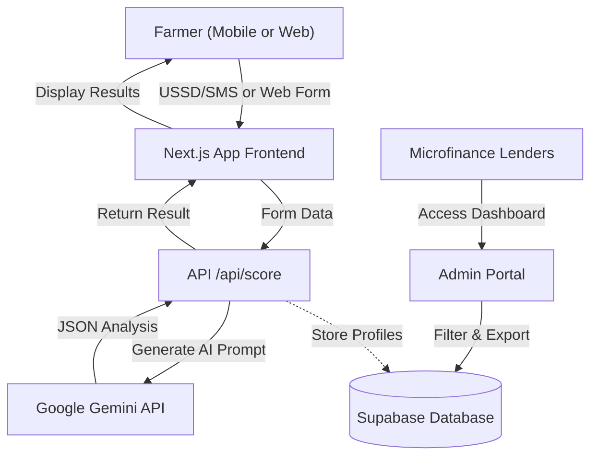

# AgriFinance AI

**AgriFinance AI** is an AI-powered microfinance platform designed for the FEED challenge (Financial inclusion, Education, Environment, Digital inclusion). It helps smallholder farmers in underserved communities access micro-loans by generating a credit score based on farm data rather than traditional banking history.

## Table of Contents
- [Features](#features)
- [Architecture](#architecture)
- [Setup & Installation](#setup--installation)
- [Usage](#usage)
- [AI Disclosure Statement](#ai-disclosure-statement)

## Features
- **AI Credit Scoring Engine**: Uses non-traditional data (farm size, experience, crop yield, irrigation) to assess creditworthiness.
- **Climate Risk Assessment**: Flags climate risks and recommends green, climate-smart farming practices tailored to the farmer's region and crop.
- **Education & Score Improvement**: Provides a "what-if" simulator that shows farmers exactly how actions like adding irrigation or building loan history will increase their credit score.
- **Lender Dashboard**: Allows microfinance institutions to view live, AI-scored farmer profiles from Supabase.

## Architecture

Below is a high-level overview of the AgriFinance AI data and application flow:



## Setup & Installation

To run this MVP locally, follow these steps:

1. **Clone the repository** (or navigate to the project folder):
   ```bash
   cd "AgriFinance AI"
   ```

2. **Install dependencies**:
   ```bash
   npm install
   ```

3. **Configure Environment Variables**:
   Create a `.env.local` file in the root directory and add your Google Gemini API key:
   ```env
   GEMINI_API_KEY=your_actual_api_key_here
   ```
   *Note: The app includes a robust fallback mock engine. If `GEMINI_API_KEY` is not provided, the application will still function predictably for demo purposes using a deterministic scoring algorithm.*

4. **Run the Development Server**:
   ```bash
   npm run dev
   ```

5. **Open the Application**:
   Navigate to [http://localhost:3000](http://localhost:3000) in your browser.

## Usage
- **Landing Page**: Navigate between the Farmer Onboarding and the Admin Portal.
- **Farmer Onboarding** (`/onboard`): Fill out the farmer profile to see the AI analysis, credit score, loan matching, and SMS/USSD simulator.
- **Admin Portal** (`/admin`): View simulated existing farmer profiles, filter by region, and review their climate risk levels.

## AI Disclosure Statement

**AgriFinance AI** utilizes generative AI (Google's Gemini model) as its core engine for credit scoring and explanation generation.

- **Purpose**: The AI is utilized to synthesize diverse, non-traditional data points (such as crop type, farm size, and years of experience) into a cohesive credit risk profile and actionable, plain-language feedback for farmers.
- **Transparency**: Every score generated by the AI includes a clear breakdown of "Positive Factors" and "Risk Factors" ensuring the reasoning is accessible and transparent to both the farmer and the lender.
- **Limitations & Guardrails**: The current implementation relies on a strictly typed JSON output schema via a high-context System Prompt to minimize hallucinations. A fallback deterministic algorithm is built-in to handle API failures or missing keys smoothly. As this is an MVP, the scoring rubric is simulated and should be calibrated with real actuarial data before production deployment.
